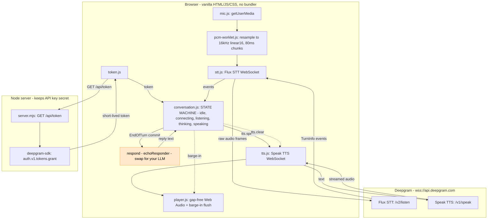

# Basic HTML/JS — Voice UI Best Practices

A small, **framework-independent** reference implementation of a realtime voice
UI, built on Deepgram streaming STT and TTS. No bundler, no dependencies in the
browser — just HTML, CSS, and ES modules.

For the *why* behind every behavior, see the shared guide:
[**BEST_PRACTICES.md**](../../BEST_PRACTICES.md).

The demo captures your microphone, transcribes it live with **Deepgram Flux**
(`/v2/listen`), detects when you finish a turn, and speaks your words back with
**Deepgram Speak** (`/v1/speak`). It supports **start/stop**, **voice-activity
feedback**, and **barge-in** (talk over the playback and it stops instantly).

> Direct STT/TTS — **not** the Voice Agent platform. There's no LLM; the demo
> echoes you. The one-line spot where an LLM would go is marked in
> [`public/src/conversation.js`](public/src/conversation.js).

## Architecture



The browser talks **directly** to Deepgram (lowest latency); the server exists
only to keep the API key secret and hand out short-lived tokens. See the SDK/
browser note at the bottom of [BEST_PRACTICES.md](../../BEST_PRACTICES.md).

## Quick start

Requires **Node 18+** and a Deepgram API key ([console.deepgram.com](https://console.deepgram.com)).

```sh
npm install
cp .env.example .env      # then edit .env and set DEEPGRAM_API_KEY
npm run dev               # or: npm start
```

Open **http://localhost:3000**, click **Start listening**, allow the mic, and
speak. Pause, and it repeats your turn. Talk over it to trigger barge-in.

> Use `http://localhost` (or https). Microphone capture is blocked on insecure
> origins.

## Project layout

| Path | Role |
|---|---|
| [`server/server.mjs`](server/server.mjs) | Token endpoint (`/api/token`) + static file server |
| [`public/index.html`](public/index.html) · [`styles.css`](public/styles.css) | UI shell (theme-aware, accessible) |
| [`public/pcm-worklet.js`](public/pcm-worklet.js) | Audio-thread capture: resample → 16 kHz linear16 → 80 ms chunks |
| [`public/src/mic.js`](public/src/mic.js) | `getUserMedia` + worklet wiring |
| [`public/src/stt.js`](public/src/stt.js) | Flux WebSocket (turn events) |
| [`public/src/tts.js`](public/src/tts.js) | Speak WebSocket (streamed audio) |
| [`public/src/player.js`](public/src/player.js) | Gap-free Web Audio playback + barge-in flush |
| [`public/src/conversation.js`](public/src/conversation.js) | The state machine — turn-taking, barge-in, response seam |
| [`public/src/token.js`](public/src/token.js) · [`config.js`](public/src/config.js) · [`ui.js`](public/src/ui.js) · [`app.js`](public/src/app.js) | Tokens, config, DOM, wiring |

## Configuration

Set in `.env` (see [`.env.example`](.env.example)): `DEEPGRAM_API_KEY`, `PORT`,
`TOKEN_TTL_SECONDS`. Models and sample rates live in
[`public/src/config.js`](public/src/config.js) (default STT `flux-general-en`
@ 16 kHz, TTS `aura-2-thalia-en` @ 24 kHz).

## Make it a real assistant

Replace `echoResponder` (or pass a `respond` function) in
[`conversation.js`](public/src/conversation.js) with a call to your LLM. It can
return a `Promise<string>`, or you can stream tokens into `tts.speak()` as they
arrive. The capture / turn-taking / barge-in / playback machinery is unchanged.
</content>
</invoke>
